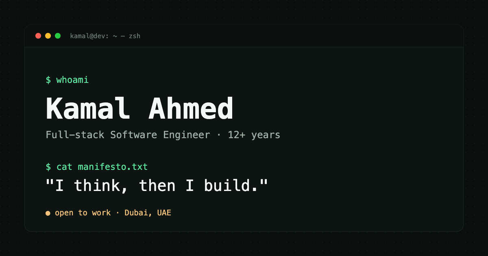

# Terminal Portfolio

A single-page developer portfolio with a terminal aesthetic. No framework, no
build step, no dependencies — just HTML, CSS, and vanilla JavaScript.

**Live:** [kamalahmed.me](https://kamalahmed.me)



---

## Features

- **Interactive terminal** — a real command line for browsing projects. `ls`,
  `open <project>`, `whoami`, `help`, command history with ↑/↓
- **Live GitHub data** — star counts, languages, and the contribution heatmap
  are pulled from the GitHub API, with a cached fallback to static data
- **Draggable ID badge** — a lanyard card on a damped-spring pendulum
- **Working contact form** — posts to [Web3Forms](https://web3forms.com), and
  still submits with JavaScript disabled
- **Four playable games** — snake, typing test, memory matrix, sequence recall,
  with synthesised sound (no audio files)
- **Dark / light themes** — toggled with an animated circular wipe via the View
  Transitions API, remembered across visits
- **Mobile-first responsive** — every media query lives in one file
- **Accessible** — semantic landmarks, keyboard navigable, visible focus rings,
  `prefers-reduced-motion` respected throughout
- **Fast** — no framework, no bundler. Roughly 60 KB of code, all of it yours

---

## Quick start

```bash
git clone https://github.com/kamalahmed/terminal-portfolio.git
cd terminal-portfolio
open index.html          # macOS  (or just double-click it)
```

That's it. There's genuinely no build step — the site works straight from the
filesystem, which is why it uses classic `<script>` tags rather than ES modules.

If you'd rather use a local server (needed if you want to test the GitHub API
calls without CORS quirks):

```bash
python3 -m http.server 8000
# then visit http://localhost:8000
```

---

## Project structure

```
terminal-portfolio/
├── index.html              All markup. Commented section by section.
├── css/
│   ├── 01-variables.css    Design tokens — colours, fonts, spacing  ← restyle here
│   ├── 02-base.css         Reset, typography, keyframes, a11y helpers
│   ├── 03-components.css   Buttons, window chrome, cards, chips, fields
│   ├── 04-layout.css       Nav, page shell, footer
│   ├── 05-sections.css     One block per page section
│   └── 06-responsive.css   Every media query               ← mobile layout here
├── js/
│   ├── config.js           Form key, GitHub username, feature flags  ← settings
│   ├── data.js             Projects, skills, services          ← your content
│   ├── utils.js            Shared helpers
│   ├── theme.js  audio.js  nav.js  reveal.js  badge.js  typed.js
│   ├── activity.js  projects.js  terminal.js  skills.js  contact.js
│   ├── games/              shell.js + snake, typing, memory, sequence
│   └── main.js             Boots everything (loads last)
└── images/                 Placeholder art — see images/README.md
```

Everything attaches to a single global, `window.TP`, so there are no module
loaders and nothing leaks into the global scope beyond that one object.

---

## Make it yours

### 1. Your details

Names, headings, and body copy live directly in `index.html`. Search for
`EDIT:` — each editable block is marked.

```html
<h1 class="hero-name">Kamal Ahmed</h1>
<p class="hero-role">
  <span class="accent-amber">// কামাল</span> · Full-stack Software Engineer · Dubai, UAE
</p>
```

Also update, in the `<head>`: `<title>`, the description, the canonical URL, and
the Open Graph tags.

### 2. Your projects

Edit the `PROJECTS` array in `js/data.js`. One object per project:

```js
{
  id: 'invoicer',              // must match your GitHub repo name for live stars
  name: 'Invoicer',
  tagline: 'Fast, clean invoicing for freelancers.',
  type: 'app',                 // 'app' | 'plugin' | 'oss' | 'tool'
  language: 'TypeScript',
  stack: ['Next.js', 'React'],
  live: 'https://invoicer.example.com/',
  repo: 'https://github.com/you/invoicer',   // null hides the "source" button
  featured: true,              // true = also gets a card in ~/apps
  image: 'images/projects/invoicer.svg'
}
```

Projects appear in the `~/work` terminal automatically. Setting
`featured: true` also gives them a card in `~/apps`.

> **Tip:** make `id` exactly match your GitHub repo name. That's how live star
> counts and languages get matched — a mismatch silently falls back to the
> static values.

### 3. Your colours

Everything resolves to variables in `css/01-variables.css`. To change the whole
accent colour, edit one pair in **both** theme blocks:

```css
:root {
  --green:  #5ee6a0;   /* primary accent */
  --green2: #8ff0bd;   /* brighter hover partner */
}
html[data-theme="light"] {
  --green:  #0e8f52;
  --green2: #0aa85e;
}
```

That single pair drives prompts, buttons, links, borders, glow effects, the
heatmap, skill bars, and the game graphics.

### 4. Your contact form

The form posts to [Web3Forms](https://web3forms.com) — free, no account, 250
submissions/month.

1. Go to [web3forms.com](https://web3forms.com), enter your email, and they send
   you an access key.
2. Paste it into `js/config.js`:

```js
WEB3FORMS_KEY: 'your-key-here',
```

3. In the Web3Forms dashboard, **restrict the key to your domain**. The key is
   public by design — it ships in the page, as it must to work at all. Domain
   restriction is what makes a copied key useless to anyone else.

The form is a real `<form>` with a real `action`, so it works even with
JavaScript disabled. `js/contact.js` upgrades it to an inline submit that keeps
the terminal-style confirmation.

### 5. Your images

See [`images/README.md`](images/README.md) for filenames and sizes. Short  
version: replace `images/avatar.svg or id-pic.jpeg`  with your photo, drop project screenshots  
into `images/projects/`, and point `data.js` at them.

### 6. Turn things off

In `js/config.js`:

```js
features: {
  sound: true,       // game sound effects
  games: true,       // the entire ~/playground section
  badgeSwing: true,  // draggable pendulum ID card
  reveal: true       // fade-in-on-scroll animations
},
LIVE_GITHUB: true    // set false to skip all network calls
```

---

## Adding things

<details>
<summary><strong>Add a terminal command</strong></summary>

In `js/terminal.js`, add to the `COMMANDS` array:

```js
{
  match: c => c === 'uptime',
  run: () => ({ kind: 'text', text: 'shipping since 2014' })
}
```

Return one of:
- `{ kind: 'text', text }` — plain output
- `{ kind: 'list', filter }` — a project table
- `{ kind: 'detail', id }` — one expanded project

Then add a line to `HELP_TEXT` so people can find it.
</details>

<details>
<summary><strong>Add a nav section</strong></summary>

1. Add `<li><a href="#yourid">~/yours</a></li>` to `.nav-links` in `index.html`
2. Give your `<section>` `class="wrap section" id="yourid"`

Scroll highlighting and smooth scrolling pick it up automatically — don't
hardcode an active class.
</details>

<details>
<summary><strong>Add a game</strong></summary>

1. Create `js/games/yourgame.js` following the pattern in `memory.js`
2. Use `window.TP.gameShell.create()` and `.overlay()` for the window chrome
3. Add a mount `<div id="gameYours">` to `.play-grid`
4. Add a `<script defer src="js/games/yourgame.js">` before `main.js`
5. Boot it in `js/main.js`
</details>

---

## Deploying

### Custom domain (what this repo is set up for)

The `CNAME` file points at `kamalahmed.me`. To use your own domain, change that
file, then in **Settings → Pages** set the source to `main` / `root` and enter
your domain under "Custom domain".

At your DNS provider, for an apex domain add four `A` records:

```
185.199.108.153
185.199.109.153
185.199.110.153
185.199.111.153
```

For a subdomain (`www` or `portfolio`), add one `CNAME` record pointing at
`<username>.github.io` instead.

Then tick **Enforce HTTPS** once the certificate is issued (can take an hour).

### GitHub Pages without a custom domain

Delete the `CNAME` file, enable Pages on `main` / `root`, and the site is served
at `https://<username>.github.io/terminal-portfolio/`. All asset paths are
relative, so it works from a subdirectory unchanged.

### Anywhere else

Netlify, Vercel, Cloudflare Pages, or any static host: no build command, and the
publish directory is the repository root. Or just drag the folder into Netlify
Drop.

---

## Browser support

Works in current Chrome, Firefox, Safari, and Edge.

Two features degrade gracefully rather than breaking:

| Feature | Without support |
|---|---|
| View Transitions API | Theme switches instantly, no wipe animation |
| `color-mix()` | Solid nav background instead of translucent |

Scroll animations, the contribution heatmap, and star counts all fail soft — if
`IntersectionObserver` is missing or the network is down, content still renders,
and the heatmap says so rather than inventing data.

---

## Notes on the code

A few decisions that might look odd out of context:

- **Classic scripts, not ES modules.** Modules are tidier, but they fail over
  `file://` because of CORS — meaning you couldn't clone this and just open
  `index.html`. That tradeoff wasn't worth it for a portfolio.
- **Vertical padding is never set with the `padding` shorthand** on `.section`.
  Sections also carry `.wrap`, which provides horizontal padding, and the
  shorthand would silently reset it — sending every section edge-to-edge on
  mobile.
- **Grids use `minmax(min(320px, 100%), 1fr)`.** A bare `minmax(320px, 1fr)`
  forces a 320px column even on a 320px screen, which causes sideways scroll.
- **No fake data.** If the contribution API is unreachable the heatmap renders
  dimmed with a note. The contact form only reports success when the API
  actually confirms delivery.

---

## Licence

[MIT](LICENSE) — free to use, fork, and adapt.

If you build your own version from it, a link back is appreciated but not
required. Please do swap out the personal content, the images, and the form key.

---

Built by [Kamal Ahmed](https://github.com/kamalahmed) · *I think, then I build.*
